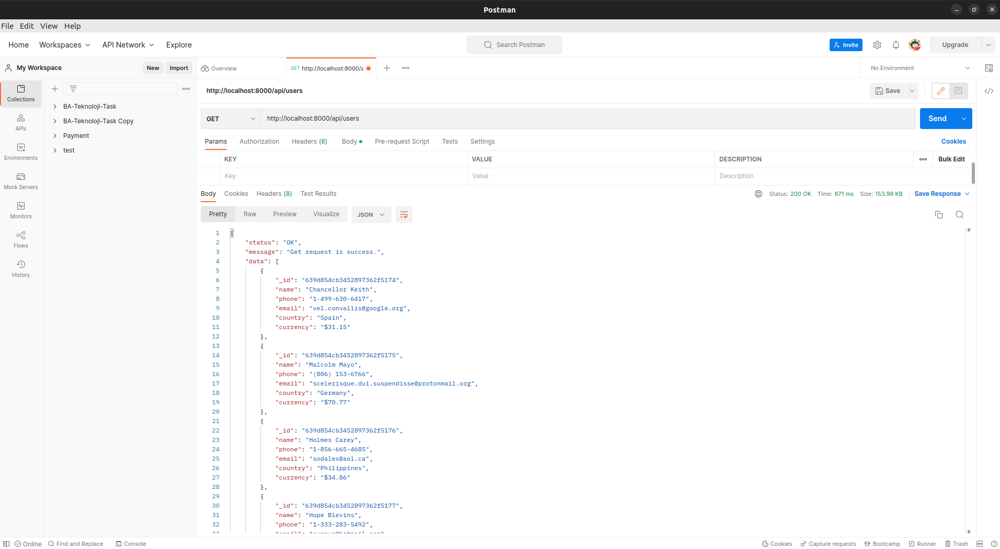
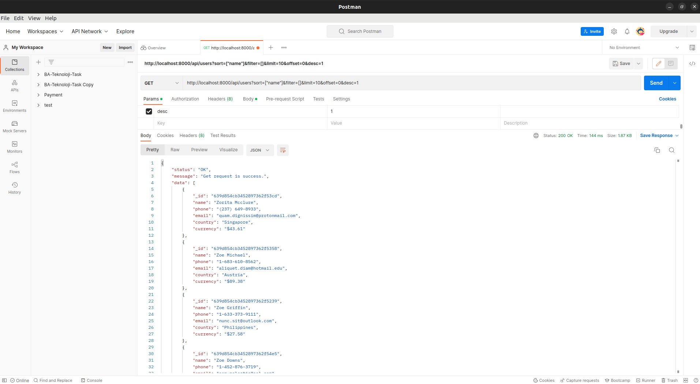
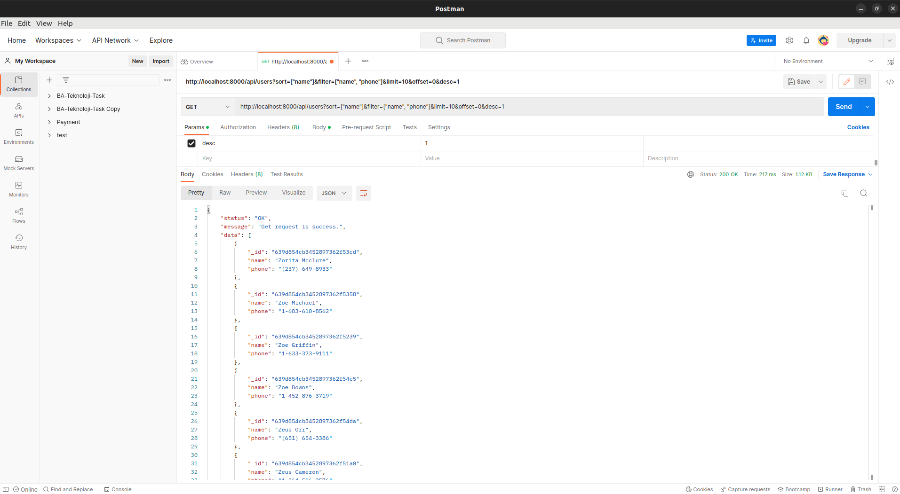

`npm start` 

to run backend

It has 2 endpoint. /api/users endpoint get user from mongodb. If request has query param,
sort, filter data as. But data filtering made ob frontend side because of material
ui DataGrid capabilities.

### With No Query Params

### Ascending Sort as Name

### Descending Sort as Name

### Descending sort, filter name and phone column

